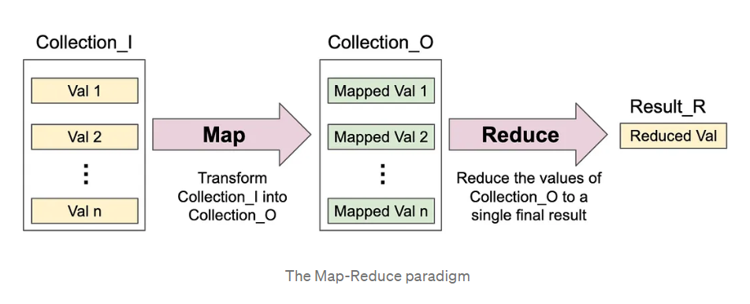

# MapReduce Implementation

## Overview

This repository contains a concurrent implementation of the map-reduce paradigm as a function in Go. This is inspired by the seminal paper "MapReduce: Simplified Data Processing on Large Clusters" by Jeffrey Dean and Sanjay Ghemawat. MapReduce is a programming model and associated implementation for processing and generating large datasets that can be parallelized across distributed clusters of computers. The primary goal of MapReduce is to make it easy for developers to write scalable and fault-tolerant data processing applications.

## Background

MapReduce was developed by Google to address the challenges of processing large-scale datasets efficiently. Before MapReduce, handling such datasets required complex, custom code for distributed computing, fault tolerance, and data distribution. MapReduce simplified this process by introducing a high-level programming model that abstracted away many of these complexities.

### Why MapReduce was needed:

1. **Scalability**: Traditional data processing frameworks were not designed to scale easily across large clusters of commodity hardware. MapReduce allows horizontal scaling, making it feasible to process petabytes of data efficiently.

2. **Fault Tolerance**: Handling failures in distributed computing was a significant challenge. MapReduce automatically handles task retries and reassigns work to other nodes when failures occur.

3. **Ease of Use**: Writing distributed applications was a complex and error-prone task. MapReduce abstracted away many of the low-level details, enabling developers to focus on writing simple map and reduce functions.

4. **Data Distribution**: Distributing data evenly across nodes for processing was a non-trivial problem. MapReduce automates data partitioning and distribution, ensuring balanced workloads.

## Key Components and Tradeoffs

### Key Components:

1. **Mapper**: The Mapper processes input data and generates key-value pairs. It is responsible for dividing the input data into smaller chunks and applying a user-defined function to each chunk.

2. **Reducer**: The Reducer receives the output of the Mapper, groups it by key, and applies a user-defined reduce function to each group. Reducers aggregate and process the intermediate data generated by the Mappers.

3. **Shuffling and Sorting**: After the mapping phase, MapReduce performs a shuffle and sort operation to ensure that all values associated with the same key are processed together by a single Reducer.

4. **Partitioning**: The Partitioner determines which Reducer receives each intermediate key-value pair. It ensures that data with the same key ends up at the same Reducer.

5. **Coordinator**: The Coordinator manages the overall execution of the MapReduce job. It assigns tasks to workers, monitors their progress, and handles failures.

### Implementation Parts

This repository goes four major revisions to implement MapReduce:

1. **Design the Data Structure**: Implement the data structure that will hold the MapReduce job status. This structure should keep track of task progress, completion, and any failures.

2. **Design Communication**: Define the communication protocol between the Coordinator and Worker nodes. This includes task assignment, progress updates, and error reporting.

3. **Map/Reduce Job Handling**: Develop the logic for the Mapper and Reducer tasks. Ensure that they properly process the input data, produce intermediate results, and handle any errors.

4. **Coordinator**: Create the Coordinator component responsible for managing the overall MapReduce job. It should assign tasks to Workers, monitor their progress, and react to failures.

## Usage

Please refer to the documentation and code within this repository for specific usage instructions and examples on implementing MapReduce.

## License

This project is licensed under the MIT License. See the [LICENSE](LICENSE) file for details.